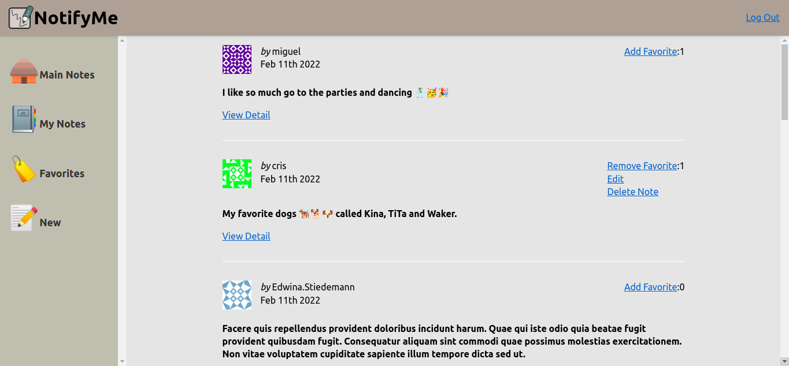

# Learning about Graphql, React, Electron focused on Javascript



This repository collected chapter of the book "Javascript Everywhere - Building Cross-Platform Applications with GraphQL, React, React Native, and Electron" by Adam D. ScottIt classifies in different chapters but it reproduce from the chapter 13 called "Styling an application".

It classifies in different chapters but I reproduce it from the chapter 13 called "Styling an application".

In order to run you need to download all packages demandes from package.json with npm tool
and you need to run web and api together.

Notedly Api is run with ```npm run dev``` (inside of web directory)

Notedly Web is run with ```npm run dev``` (inside of api directory)

If you want to view the deployment of this page you could visit deployment site.

https://peaceful-hermann-c96c3d.netlify.app/


