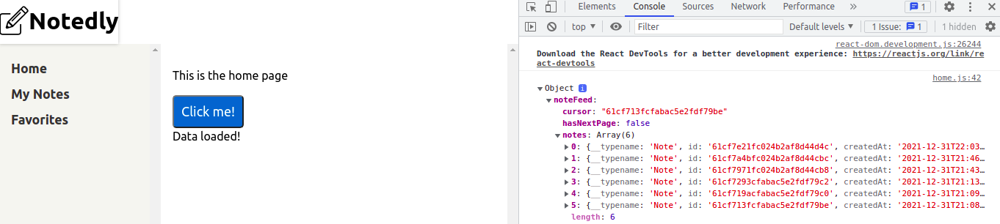

# Chapter 14: "Working with Apollo Client"

## Setting Up Apollo Client

Some initial result


the web work with the help of Parcel it assigns values from  .env file in this case we need the uri server (backend area) which is the address which connects our web client to our API server.

It needs apollo client libraries
```import {ApolloClient, ApolloProvider, InMemoryCache} from '@apollo/client';```

It helps to define uri address, cache and share this with apollo provider
It will be the new label of our App web

```

//configure Apollo client
const client = new ApolloClient({
  uri,
  cache,
  connectToDevTools: true
});

cons App = () => {
  return(
    <ApolloProvider client={client}>
      ...
    </ApolloProvider>
  )
}
```

In order manage queries inside of web api you need to follow 3 steps:

1. Consider what data the query needs to return (what do you want of your query?)
2. Write the query in the GraphQl Playground (test your query created)
3. Integrate the query into the client application (manage return and organiza how to display it)

The integration is with useQuery and language graphql "gql" from apollo client which you write your query or copy from the playground but with parameters and variables which manage it better. For example:

```
//import the required libraries
import {useQuery, gql} from '@apollo/client'; 

//ur GraphQl query, stored as a variable
const GET_NOTES = gql`
  query NoteFeed($cursor: String){
    noteFeed(cursor: $cursor){
      cursor
      hasNextPage
      notes{
        id
        createdAt
        content
        favoriteCount
        author{
          username
          id
          avatar
        }
      }
    }
  }
`;
```

Use this prototype and call the new query and return data, loading, an error which manage load, error messages and data itself. (fetchMore is a function) from prototype

```
const {data, loading, error, fetchMore} = useQuery(GET_NOTES);
```

with data you could acces to the values of json returned like this

```
<div>
  {data.noteFeed.notes.map(note=>(
    <div key={note.id}>{note.author.username}</div>
    ))
  }
</div>
```


There exist some style in order to add style to return data as markdown style using this ``` import ReactMarkdown from 'react-markdown' ``` library and put the next label:

```
<ReactMarkdown source={note.content}/>
```

#### Using routes

A routeyour  could help you create some views that you need, for example if you need to view an specific view you could use a url with parameters pass in the same url and route this with the new component.

created view:

```
import React from 'react';
const NotePage = props => {
  return (
    <div>
    {/*It collects from url the id*/}
    <p> ID: {props.match.params.id} </p>
    </div>
    );
}
```

with the view created you only import and route this

```
import {BrowserRouter as Router, Route} from 'react-router-dom'
import  NotePage from './note';
...
<Router>
  <Layout>
    <Route path="/note/:id" component={NotePage}/>
  </Layout>
</Router>
```

even you use the id from the url in order to make a query, in this case we use Link package in order to route the content.

Remember that NoteWrapper encapsulates all notes as a component
and Note encapsulates an isolated note inside of all notes again as a component you could view more from the book.

```
import {Link} from 'react-router.dom';
<NoteWrapper key={note.id}>
  <Note note={note}/>
  <Link to={`note/${note.id}`}>Permalink</Link>
</NoteWrapper>
```

#### Pagination

This is more exciting thing, there is a query which return only 10 notes and return cursor (id note) and hasNextPage (flag if there is more notes). We could use the fetchMore function from data returned from a query "noteFeed" in order to acces to new data and joint this with old data and return 10 more notes. This is a manage the click on button "LoadMore" and access to data, old (previoudResult) and new (fetchMoreResult)
it recursively save (cursor and hasNextPage) in order to view again the LoadMore Button or not.

```
return(
    //Add a <React.Fragment> element to provide a parent element
    <React.Fragment>
      <NoteFeed notes={data.noteFeed.notes}/>
      {/*Only display the load button if hasnextpage is true*/}
      {data.noteFeed.hasNextPage &&(
        <Button
          onClick={()=>
            fetchMore({
              variables:{
                cursor: data.noteFeed.cursor
              },
              updateQuery: (previousResult, {fetchMoreResult}) =>{
                return{
                  noteFeed:{
                    cursor: fetchMoreResult.noteFeed.cursor,
                    hasNextPage: fetchMoreResult.noteFeed.hasNextPage,
                    //COMBINE the new results and the old
                    notes:[
                      ...previousResult.noteFeed.notes,
                      ...fetchMoreResult.noteFeed.notes
                    ],
                    __typename: 'noteFeed'
                  }
                };
              }//update query
            })//if there is fetchMore
          }//click function
        >
        Load More
        </Button>
      )}
    </React.Fragment>
  );

```
