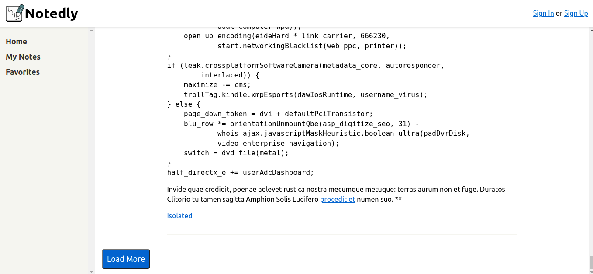

# Chapter 15: Web Authentication and State

The App progrees include loging signin and signup actions like this...


## Signin In component

It begins with a form with fields username, email and password in order to create a new account and register this user in the data of users, it has styles according to separations between labels and
inputs and centered. It uses htmlfor in the tags or labels which belongs to JSX


## React Forms and State
then it includes React hooks, in this case evaluate changes on the form (when you click on submit button and put all form values in json format) we learn more about this in this link [react hooks](https://reactjs.org/docs/hooks-intro.html)


## SignUp Mutation

Other point, It includes mutation inside of component with gql in this case user the same syntax with call the correct mutation with parameters type and then pass the respectively like this:
```
const SIGNIN_USER = gql`
  mutation signIn($email: String!, $password: String!){
    signIn(email: $email, password:$password)
  }
`;
```

## JSON Web Tokens and Local Storage

We have the correct mutation and returns the json web token when the registration is succesfull.
So It needs the Local Storage in order to save the "jwt" so we get and set like this:

```
localStorage.setItem('token',data.signIn);
localStorage.removeItem('token');
```

## Redirects

The base redirects is with history of pages that user visited in this case when user complete the signip form it redirect to home page, acces with the props
```
props.history.push('/');
```


There exist some special route when you try to show some route but with some condition you need to change with other default view, for example signin view because user don't have the correct
permissions. It is builded with private component with manages correct components in order to show like MyNotes or MyFavorites and with the condition redirect to SignIn Component, like this...

```
const Pages = () => {
  return(
    <Router>
      {/*Wrap our routes within the Layout component*/}
      <Layout>
        <Route exact path="/" component={Home}/>
        <PrivateRoute path="/mynotes" component={MyNotes}/>
        <PrivateRoute path="/favorites" component={Favorites}/>
        <Route path="/note/:id" component={NotePage}/>
        <Route path="/signup" component={SignUp}/>
        <Route path="/signin" component={SignIn}/>
      </Layout>
    </Router>
  );
};


```

## Attaching Headers to Requests

In order to pass the jwt to header we set with setContext command and pass in autorazation field the jwt...

```
//setcontext with the jwt like as autorization header
const authLink = setContext((_, {headers}) => {
  return{
    headers: {
      ...headers,
      authorization: localStorage.getItem('token') || ''
    }
  };
});
```
Then It will be concatenate with the general Url "http://localhost:4000" with the apollo client

```
//configure Apollo Client
const client = new ApolloClient({
  link: authLink.concat(httpLink),
  cache,
  resolvers: {},
  connectToDevTools: true
});

```

## Local State Management

In this case when we need to share some data across out application, you requires apollo client to achieve this.
```
client.writeData({data: {isLoggedIn: true}});
```

then in the App.js you need field of empty resolvers in order to make queries in local cache
```
//localQuery
const IS_LOGGED_IN= gql`
  {
    isLoggedIn @client
  }
`;
```

and you could use this query in your component in order to view what is the value of isLoggedIn
```
  //query hook for user logged-in state,
  //including the client for referencing the Apollo store (saving your jwt or flag loggedin)
  const {data, client} = useQuery(IS_LOGGED_IN);

```

## Logging Out 

When we logout from app, we need to reset and clear the jwt and the local cache memory so with these lines we can achieve this...
```
<UserState>
{data.isLoggedIn ? (
    <ButtonAsLink
      onClick={()=>{

        //remove the token (jwt)
        localStorage.removeItem('token');

        console.log(data)
        //clear the application's cache (using apollo client) (cache)
        client.resetStore();
        
        //update local state (using apollo client) (flag)
        client.writeData({data:{isLoggedIn: false}});
        
        //redirect the user to the home page
        props.history.push('/');
      }}
    >
      Log Out
    </ButtonAsLink>
  ) : (
    <p>
      <Link to={'/signin'}>Sign In</Link> or{' '}
      <Link to={'/signup'}>Sign Up</Link>
    </p>
  )}

</UserState>
```

an key point on this, when you need to include routing in a component that is not itself directly routable, we need to use React Router's withRouter higher order component. So you export Header
component like this.
```export default withRouter(Header);```

## Sign in Form

in order to create a abstract component an then we some condition render an specific component we could use this.

```
//include the props passed to the component for later use
const UserForm = props => {
  
  //Set the default state of the form
  const [values, setValues] = useState();

  //update the state when a user types in the form
  const onChange = event => {
    //produce tuples of name and value properties when is updating every field of form
    //in this updating is click on submit button
    //...values means for all values received
    setValues({
      ...values,
      [event.target.name]: event.target.value
    });
  };

  //JSX attribute htmlFor instead of "for" in order to avoid collisions 
  return (
    <Wrapper>
      {/*Display the appropiate form header*/}
      {props.formType === 'signup' ? <h2>Sign Up</h2> : <h2>Sign In</h2>}
      {/* perform the mutation when a user submits the form */}
      <Form
        onSubmit={e =>{
          e.preventDefault();
          props.action({
            variables: {
              ...values
            }
          });

        }}
      >
        {props.formType === 'signup' && (  
          <React.Fragment>
            <label htmlFor="username">Username:</label>
            <input
              required
              type="text"
              id="username"
              name="username"
              placeholder="here your username"
              onChange={onChange}
            />
          </React.Fragment>
        )}

        <label htmlFor="email">Email:</label>
        <input
          required
          type="email"
          id="email"
          name="email"
          placeholder="here your email"
          onChange={onChange}
        />
        
        <label htmlFor="password">Password:</label>
        <input
          required
          type="password"
          id="password"
          name="password"
          placeholder="here your password"
          onChange={onChange}
        />
        <Button type="submit">Submit</Button>   
      </Form>
    </Wrapper>
  );
};

```

with props.formType divides the render in signin or signup dependes what do you want. Other thing is props.actions where it put the specific mutation for example for signin it will be like this:

```
//JSX attribute htmlFor instead of "for" in order to avoid collisions 
  return (
    <React.Fragment>
      <UserForm action={signIn} formType="signin"/>
      {/*if the data is loading, display a loading message*/}
      {loading && <p>Loading...</p>}
      {/*if there is an error, display a error message*/}
      {error && <p>Error signing in</p>}
    </React.Fragment>
  );

```


## Protected Routes

we see before in private components, it is useful when you show some view like MyNotes or MyFavorites but only when the user in registered, when the user is not registered it show the signin view

```
//Private Component
//In case of show some component but if some condition is committed
//change the component by signin so you need to use Private Component
//It is like alternative route
const PrivateRoute = ({component: Component, ...rest}) => {
  const {loading, error, data} = useQuery(IS_LOGGED_IN);
  //if the data is loading, display a loading message
  if (loading) return <p>Loading...</p>;
  if (error) return <p>Error Private Component</p>;
  //if the user is logged in, route them to the request component (MyNotes,Favorites)
  //else redirect them to the sign-in page (Log in)
  return (
    <Route
      {...rest}
      render = {props =>
        data.isLoggedIn === true ? (
          <Component {...props} />
        ) : (
          <Redirect
            to={{
              pathname: '/signin',
              state: {from: props.location}
            }}
          />
        )
      }
    />
  );
};

```
