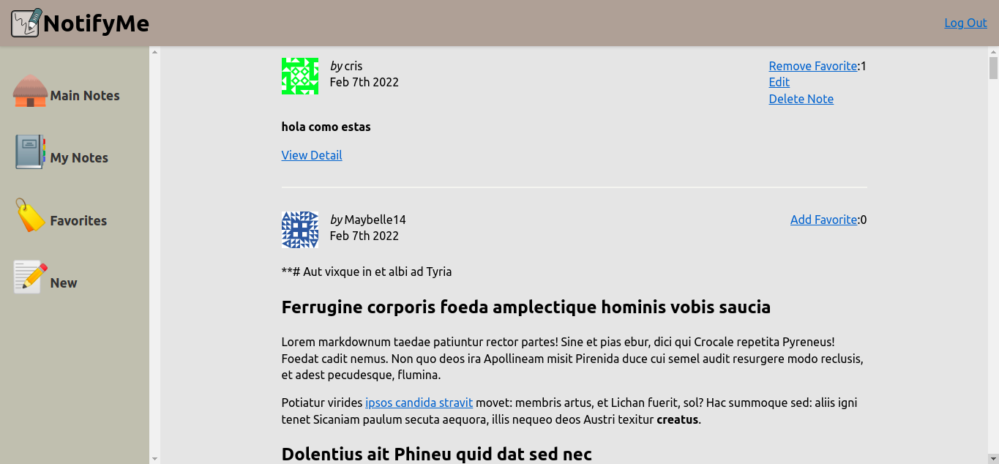

# Chapter 16: "Create, Read, Update, and Delete Operations"


The webapp to this point with CRUD Operations is like this, we change the name of notedly to NotifyMe because I like this name :p



## Creating New Notes

In the same form It creates the page that execute some initial queries. Then it creates the component which will have react hooks in order to create states of the component in this case some state
link to textArea of the note form.

Some special code is in the react hook which includes events that meanwhile user complete field values it saves this values on json format like this.

React Hook
```
  //Set the default state of the form
  //Adds property content: which is assigned by props.content of textarea else it is empty
  const [value, setValue] = useState({content: props.content || ''});
```
we include changes on the form when user update it.
```
  //update the state when a user types in the form
  const onChange = event => {
    //produce tuples of name and value properties when is updating every field of form
    //in this updating is click on submit button
    //...values means for all values received
    setValue({
      ...value,
      [event.target.name]: event.target.value
    });
  };

```

So you could use this event on textArea and set textarea content with state of this component, it has the props.content or empty depending of what kind of NoteForm is used (new or updating) like
this...
```
<TextArea
  required
  type="text"
  name="content"
  placeholder="here your Note content"
  value={value.content}
  onChange={onChange}
/>

```

Other charateristic on the component NoteForm.js is that we delegate to it executes the query which was passed by parameter, as you can see in the below code...
```
<Form
  onSubmit={e =>{
    e.preventDefault();
    props.action({
      variables: {
        ...value
      }
    });

  }}
>
```

Apollo led us to update the cache of different views in thi cases calling the required queries. For new notes we need to update the notes of the user with the specific id of the note and general list
notes in the main view of notefeed, all is possible with refetchQueries command, as you can see
in the below code...

```
const [data, {loading, error}] = useMutation(NEW_NOTE, {
  //refetch the GET_NOTES query to update the cache
  //in this case internally make get_notes query in order to update the note's list
  refetchQueries: [{query: GET_MY_NOTES}, {query: GET_NOTES}],
  onCompleted: data => {
    //when complete, redirect the user to the note page isolated
    props.history.push(`note/${data.newNote.id}`);
  }
});

```

## Reading User Notes

In this case myNotes pages led us viewing user notes, so for this actions we require current user and acces to notes of this user, it is possible with this query:

```
//Get Notes from current user
const GET_MY_NOTES = gql`
  query me{
    me{
      id
      username
      notes{
        id
        createdAt
        content
        favoriteCount
        author{
          username
          id
          avatar
        }
      }
    }
  }
`;

```

In this by parameter It could send user notes to NoteFeed component in order to render the list user notes and it is the same process for list of favorites like this...


```
if(data.me.notes.length !== 0){
  return <NoteFeed notes = {data.me.notes}/>;
}else{
  return <p>No notes yet</p>;
}

```

## Updating Notes

Create a  edit.js page, as equal to new note in this we pass as parameter the note list in Note Ccomponent, with the id pass by url. It reuses the NoteForm component but in this case the content of
TextArea appears inside of this. Other property is that we set GET_ME adn GET_NOTE query in order to update only when the user is the owner of the note else it shows the NoteForm component with the respectively
content and the note id.

some special key is sending a query to the component in this case we set some parameteres of the query like a id or redirects to a new page but this actions save on editNote that execute when the
component is show like this...


```
//define edit note or update
  const [editNote] = useMutation(EDIT_NOTE,{
    variables: {
      id
    },
    onCompleted: () => {
      //redirect to specific note finded with the id note
      props.history.push(`/note/${id}`);
    }
  });

```

and then you pass this query to the component NoteForm like this

```
return <NoteForm content={data.note.content} action={editNote}/>;
```

The query is executed in NoteForm like this...

```
<Form
  onSubmit={e =>{
    e.preventDefault();
    props.action({
      variables: {
        ...value
      }
    });

  }}
>

```

the updating note is made only if current user is the note's owner, so we have to display a link edit or component NoteUser if the user is logged in, else it show the favorite count like this...


```
{data.isLoggedIn ?(
  <UserActions>
    <NoteUser note={note}/>
  </UserActions>
):(
  <UserActions>
    <em>Favorites:</em>{note.favoriteCount}
  </UserActions>
)}

```

In the NoteUser component or component for specific user notes, it require to check current user is the same of the note's author in this case we also displat edit link like this:


```
{data.me.id == props.note.author.id && (
  <React.Fragment>
    <Link to={`/edit/${props.note.id}`}>Edit</Link><br />
  </React.Fragment>
)}

```

## Deleting Notes

It is a nonroutable component because it is a component which redirects to another component, normally, we include a redirect in pages but not in component, so for this reason this component is
a higher-order component and we need withRouter command from React.

```
import {withRouter} from 'react-router-dom';
```

Similar to new and update it requires update the cache in the general note list and user note list with
```
refetchQueries: [{query: GET_MY_NOTES},{query: GET_NOTES}]
```

the redirect in DeleteNote component is to mynotes
```
onCompleted: data =>{
  props.history.push('./mynotes');
}
```

So we reuse NoteUser component for showing the new DeleteNote component as a link
```
{data.me.id == props.note.author.id && (
  <React.Fragment>
    <Link to={`/edit/${props.note.id}`}>Edit</Link><br />
    <DeleteNote noteId={props.note.id}/>
  </React.Fragment>
)}

```


## Toggling Favorites

If we remember grapql api, toogle favorites consist in increase a count which belongs to differents users, every user only toggle favorite once, a note could not receives too many favorites by the
same user.

We create a FavoriteNote component in order to display a link and control with states the quantity of favorites in a note. We put this on NoteUser component, considering three parameters which are [me, noteId and favoriteCount]

```
<FavoriteNote
  me={data.me}
  noteId={props.note.id}
  favoriteCount={props.note.favoriteCount}
/>

```

In this case we use the react hooks in order to setState for count and for favorited like this
The first is by favoriteCount in order to increase or decrease in the view the number of favorites when user toggle or distoggle a favorite note

The second  is favorites flag in this case we filter the favorites notes is inside to the favorite list user so if atleast there are one so we set true else set false
```
//store the note's favorite count as state
const [count, setCount] = useState(props.favoriteCount);

//store if the user has favorited the note as state
const [favorited, setFavorited] = useState(
  //check if the note exist in the user favorites list (filter js)
  props.me.favorites.filter(note => note.id === props.noteId).length > 0
);
```

In the render of FavoriteNote we set like this rendering AddFavorite and RemoveFavorite.
```
<React.Fragment>
{favorited ?(
  <ButtonAsLink
    onClick={() => {
      toggleFavorite();
      setFavorited(false);
      setCount(count - 1);
    }}
  >
    Remove Favorite
  </ButtonAsLink>
):(
  <ButtonAsLink
    onClick={()=>{
      toggleFavorite();
      setFavorited(true);
      setCount(count + 1);
    }}
  >
    Add Favorite
  </ButtonAsLink>
)}
:{count}
</React.Fragment>

```

And we remember again the graphql api where toggle favorite checks if is untoggle or toggle favorite note, and remove or adds in the list of favoriteBy and remove or add in the counter Favorite
As we can see in the before code we use the functions SetFavorited and SetCount in order to update in the view for change the state.

the other is refresh cache of user favorites list like this:
```
refetchQueries: [{query: GET_MY_FAVORITES}]
```

It is awesome work frontend with react when all  backend work is done. Even we correct some issueas in the graphQl api, when we note the responde is incorrect in the views. Awesome!!!
