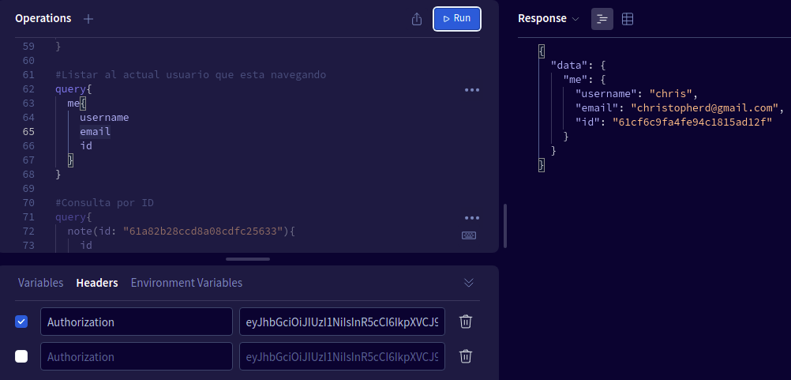

# Api notedly

It wrapper backend activities, using Grapql and MongoDb for data.


GraphQl it is a powerful tool, before you write sql commands for consulting and queries in databases, but with GraphQl writing  queries are to much easy, but you need define the models and
interactions between them, with ql language so. It reduces considerably writing querie codes. Itis more friendly for frontend and backend developers. MongoDB uses for relation and non-relation
databases and include manage with cli and cloud. Powerful tools.

Basically the core is about management of notes, the user could writing, updating, listing, add favorites notes, and other queries. And it has the different models resolver and mutations in order to do that.
Furthermore, It has control of access to every route, with login and sign actions. and it includes nested queries for connecting different entities or models. 

It has some part for deployment using  mongo DB Atlas Cluster and for DEVOPs uses Heroku, it set data base connector with the .env file and heroku control with pushing commits in its reposirory


In order to run Notedly api you need to execute "npm run dev" command (inside of web directory)

you need create users but in this case the app thinks there exist users created so for this particular reason in the file src/index.js change this for this lines 

```
    //try to retrieve a user with the token
    //comparing the token with token on environment
    const user = getUser(token);
    //const user = "vacio"
    //for now, let's log the user to the console
    //console.log(user); 

    //Add the db models to the context
    return {models, user};

```
Change for this
```
    //try to retrieve a user with the token
    //comparing the token with token on environment
    
    //Comment this
    //const user = getUser(token);
    
    //const user = "vacio"
    //for now, let's log the user to the console
    //console.log(user); 

    //Add the db models to the context
    //Take out user variable
    return {models};

```

So you could be able user signup (register) and signin(login)
use signup in order to create new user (username, email and password)
it returns api token an put this on HEADERs variables in your GraphQl playground



With this you could be able to use getUser(token) function so renew again this.
If you forget this you could user signin in order to return the api token if you remmember
the username and password. That is all


Remember you need a .env file with JSON_KEY=passphrase
you put whatever string in this because it joint with you id client in order to create
the api token


