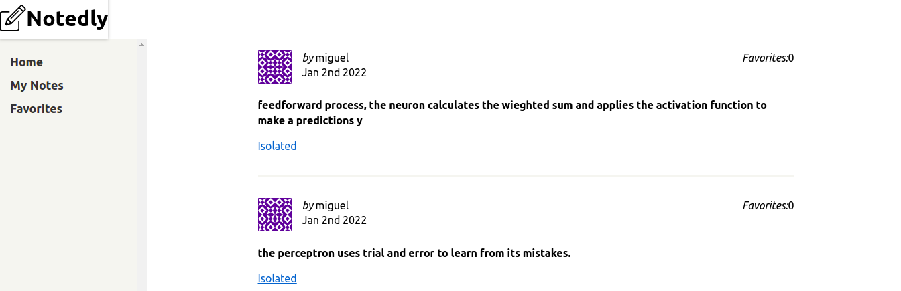

# Web Notedly

It wraper web implementation using React as UI management, it has a powerful tools for hooks and dynamic content using JSX, you could writing javascript code inside of html code. It is very similar
with templates in the markers, separates the diferent views working with modules and components, so you could reuse code and write less. Awesome.

This is some view of progress in the UI web

In order to run Notedly api you need to execute "parcel src/index.html" command (inside of web directory)
